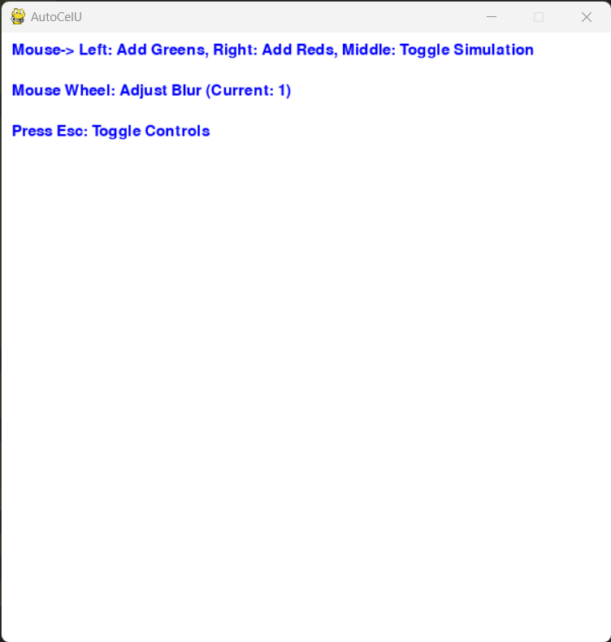
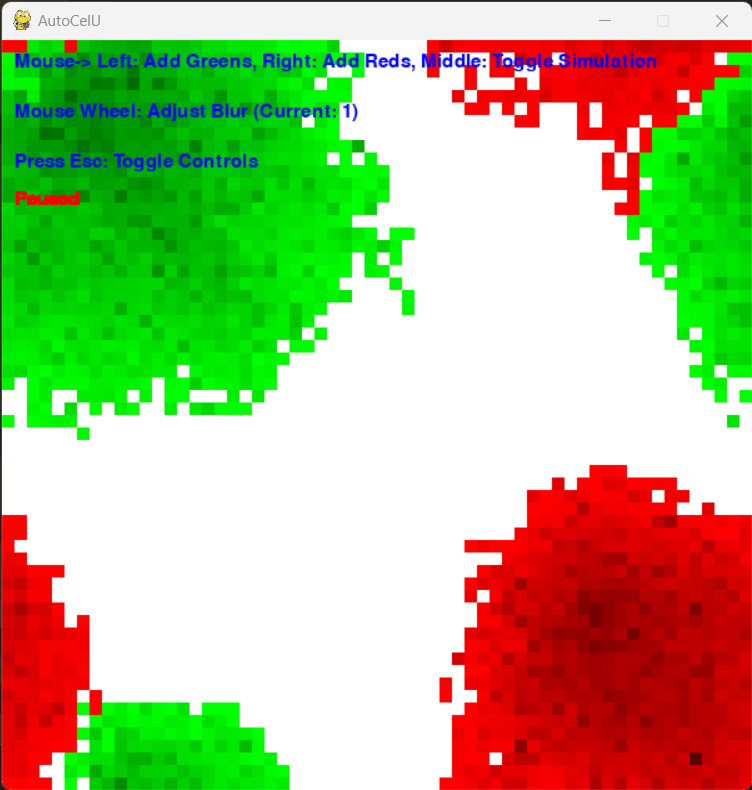
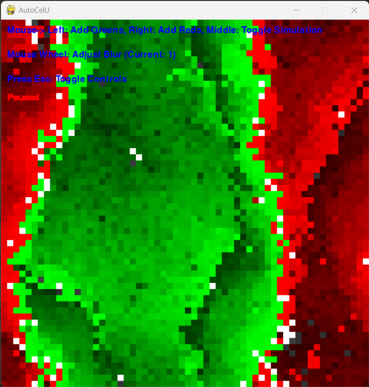
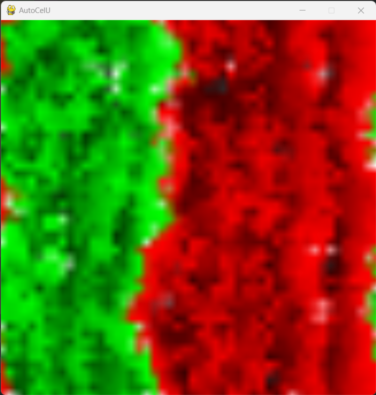
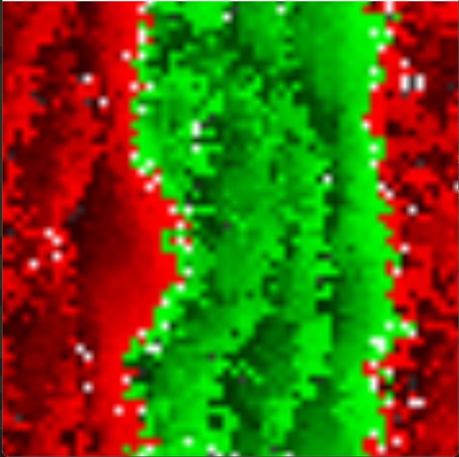

# AutoCelU

AutoCelU is a cellular automaton simulation with interactive controls. It allows you to create and observe the behaviors of cells in a grid-based environment.
This provides wavy patters and using two types of similar Cells we can see the movement of the patterns.
This incorporates the health/death mechanism for the cells, hence providing a wavy pattern.

## Features

- Add Greens and Reds cells using mouse clicks.
- Toggle simulation (Play/Pause) with the middle mouse button.
- Adjust the blur effect using the mouse wheel.

## Controls

- **Left Mouse Button:** Add Greens cells.
- **Right Mouse Button:** Add Reds cells.
- **Middle Mouse Button:** Toggle simulation.

## Adjust Blur

Use the mouse wheel to adjust the blur effect. The current blur factor is displayed on the screen.

## Pausing the Simulation

Press the `Esc` key to toggle the display of controls. This allows you to enjoy the simulation without text overlays.

## Screenshots


*Controls*


*Start of Simulation*


*Simulation*


*Blured Simulation*


*Less Blured Simulaion*

## Getting Started

1. Clone the repository:

   ```bash
   git clone https://github.com/SujalChoudhari/AutoCelu.git
   ```

2. Run the simulation:

   ```bash
   cd AutoCelu
   pip install -r requirments.txt
   python main.py
   ```

## Dependencies

- Python 3.x
- Pygame

## License

This project is licensed under the [MIT License](LICENSE).
